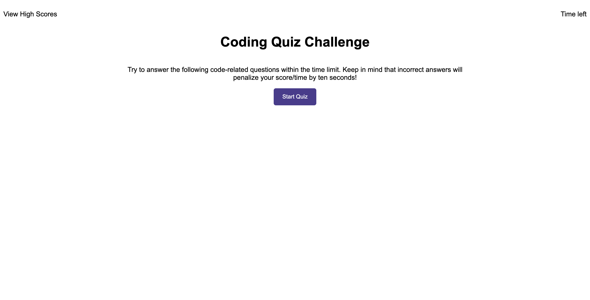

# Code-Quiz
https://jwleamy.github.io/Code-Quiz/
## Description
A JavaScript quiz to test your knowledge. 

After clicking start, the user has 60 seconds to answer a series of JavaScript related questions. When a question is answered correctly, 10 seconds is added to the timer. When answered incorrectly, 10 seconds is subtracted.

If the user finishes the quiz before time runs out, their score is recorded and added to the highscore database. (Only the top 5 scores make the list)

## Webpage Picture


## User Story / Acceptance Criteria
```
AS A coding boot camp student
I WANT to take a timed quiz on JavaScript fundamentals that stores high scores
SO THAT I can gauge my progress compared to my peers
```
(click for more)
</summary>

```
GIVEN I am taking a code quiz
WHEN I click the start button
THEN a timer starts and I am presented with a question
WHEN I answer a question
THEN I am presented with another question
WHEN I answer a question incorrectly
THEN time is subtracted from the clock
WHEN all questions are answered or the timer reaches 0
THEN the game is over
WHEN the game is over
THEN I can save my initials and score
```
## Technologies Used

1. HTML - used to create and structure the given webpage
2. CSS - used to modify the presentation and style of the given webpage
3. Git - used to clone down the original code prior to making modifications
4. Github - used to create this repository, modify and eventually commit each change made, and ultimately deploy the fully edited webpage
5. Javascript - used to generate the password after interacting with the webpage

## Code Snippet Java
```
//creates a list format for a single question
function displayq(x) {
  var ask = $("<h2>");
  var list = $("<ol>");

  for (var i = 0; i < 4; i++) {
    var yup = $("<button>");
    yup.attr("class", `listbutton${x}`);
    //Make the content of the <li> equal a possible answer
    yup.text(questionList[x].answers[i]);
    //Push the possible answer to the list of options
    list.append(yup);
  }
  ask.attr("class", "p" + [x]);
  //create a h2 with the question
  ask.text(questionList[x].question);
  //append list to ask
  ask.append(list);
  //append list to newquestion
  whole.append(ask);

  $(`.p${x}`).hide();
}

//based on your clicked answer, you will either move on to the next question or subtract 10 points from your score
function game(x) {
  console.log(x);
  if (!yessir[x]) {
    showscore();
  } else {
    console.log(yessir[x]);
    $(`.listbutton${x}`).on("click", function () {
      if ($(this).text() === yessir[x]) {
        $(`.p${x}`).hide();
        $(`.p${x + 1}`).show();
        game(x + 1);
      } else {
        secondsLeft = secondsLeft - 10;
      }
    });
  }
}
```